### First look 

Loading the binary in gdb, we see that we have a monster,
with some 'attack' options 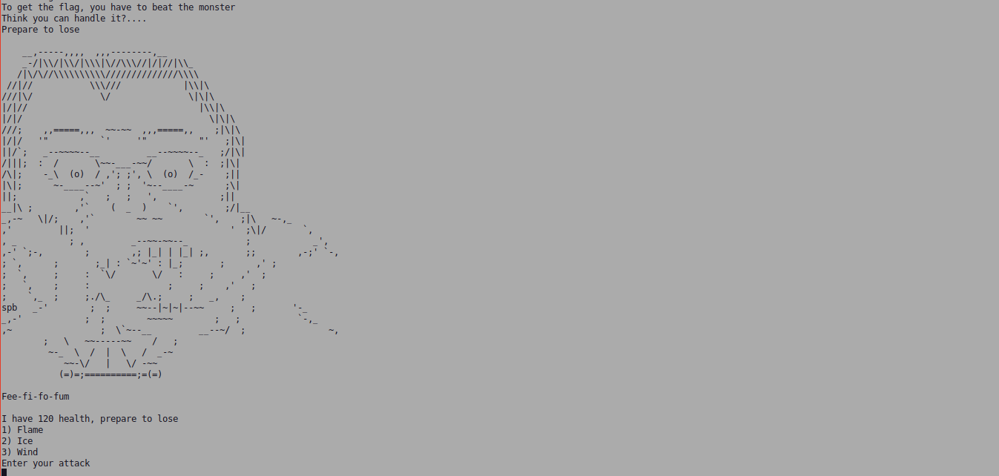

Looking at  the possible attacks, it seems that the player is at quite a disadvantage
with some of the choices 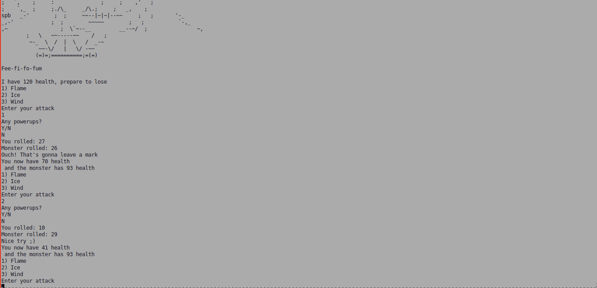

Observe that the only two options for 'powerups' are Y/N, 
anything else will panic 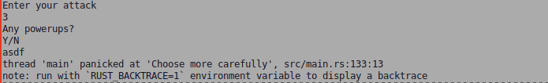

Even if we somehow beat the monster, we don't get the flag.
But why? 

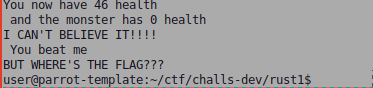

Time for a closer look...

### Static analysis

I'll be using ghidra here, but IDA or others should work fine 
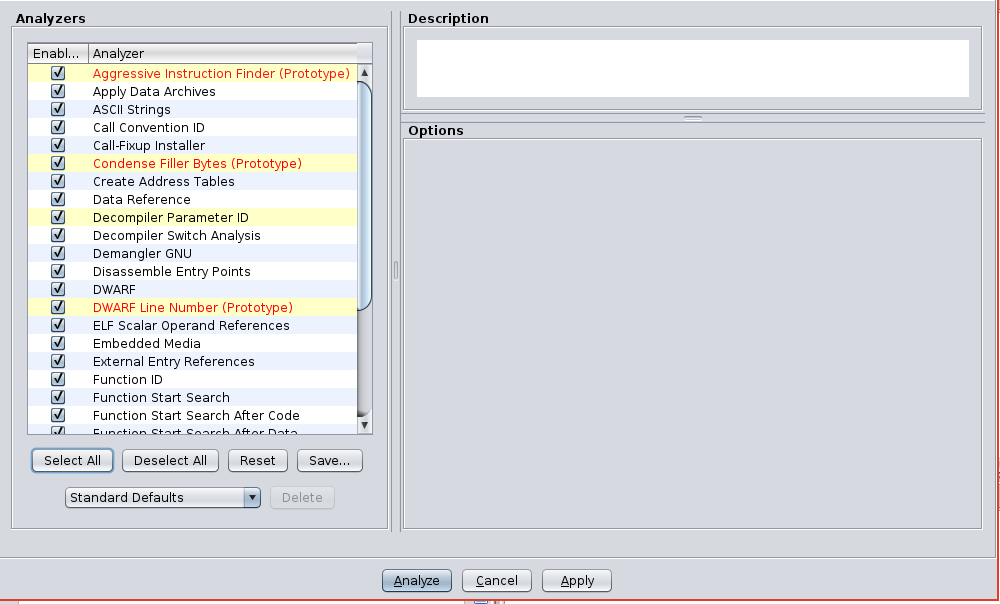

Give ghidra about 5 or so minutes to analyze everything.

Binary isn't stripped, luckily for the reader ;)

Here's what looks like main. Looks nice and easy, right? No.
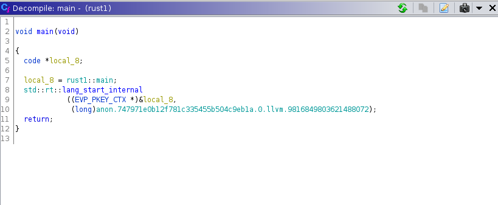


Click on ```rust1::main``` and see why 
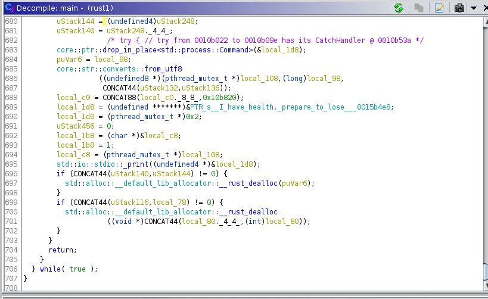

Just over 700 lines of decompiler output, not the end of the world though.

Let's begin by renaming things that match what was seen in 'First Look'

For example, we'll name the string that includes our 'monster' plus our 
attack options as ```ascii_blob```

Observe ```local_1d8```, it probably is the string that prints the 'To get the flag'..... string that
this challenge first prints out. We can confirm this by running the binary in gdb 
and setting a breakpoint at the std::io::print call 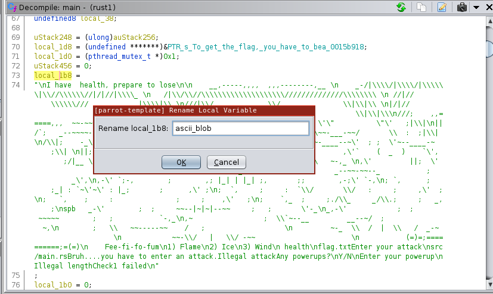

Observe the string contents in rdi 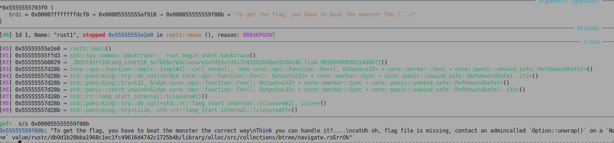

We can repeat this process for similar strings

Notice at line 107, there's a call to initialize ```thread_rng```,
see https://docs.rs/rand/0.6.1/rand/fn.thread_rng.html for how this works

What are these weird values at line 116?
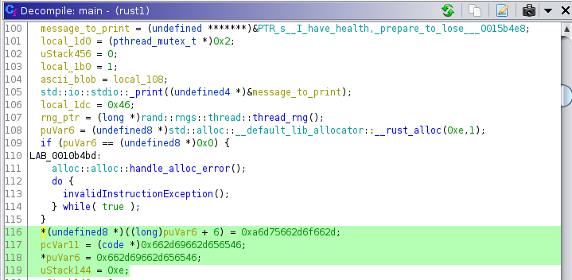

If we select them and navigate to the corresponding ghidra listing,
it looks like part of our menu that gets printed out.

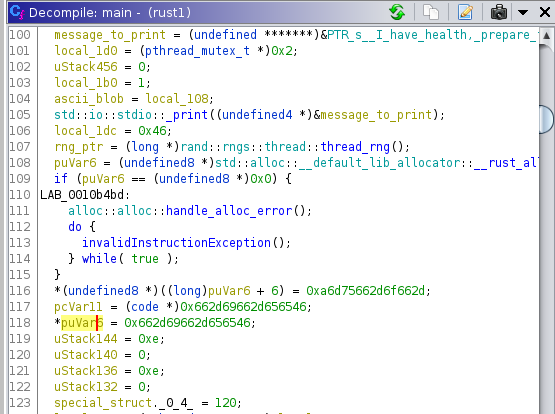

Also, observe that the monster's health gets set to 120 in what appears (from our POV) to a struct,
so I renamed it accordingly.

Moving down to line 145, we see our 'win' condition that
fires if the monster reaches 0 health.
But it doesn't print the flag....so keep looking.
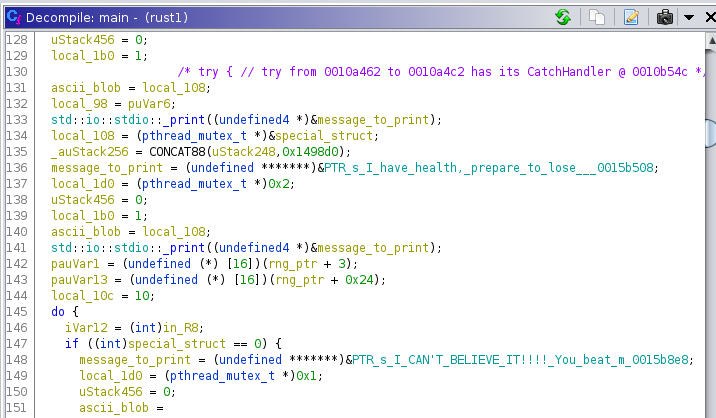 

A little later, there's also our 'lose' condition 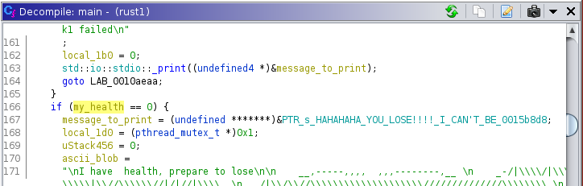

After this is just the instructions for menu printing, nothing important.

Going to 216, we see some _weird_ output from ghidra 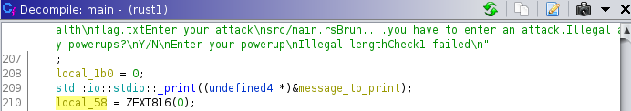

Go to the assembly listing, we see that this is just zeroing out floating point register xmm0
and ghidra rendering it weird 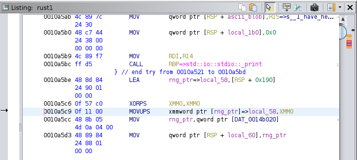

Next, we have the section that checks if the attack is valid 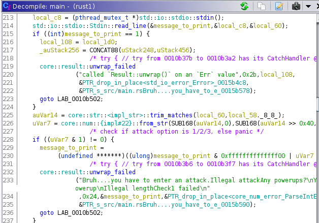

Moving forward in the 'powerup' section, we have the section that enforces a 22 len. 
requirement on the powerup. This can be checked in gdb by setting a breakpoint like
so 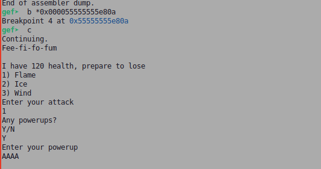 

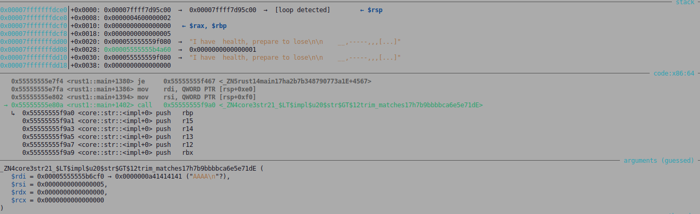

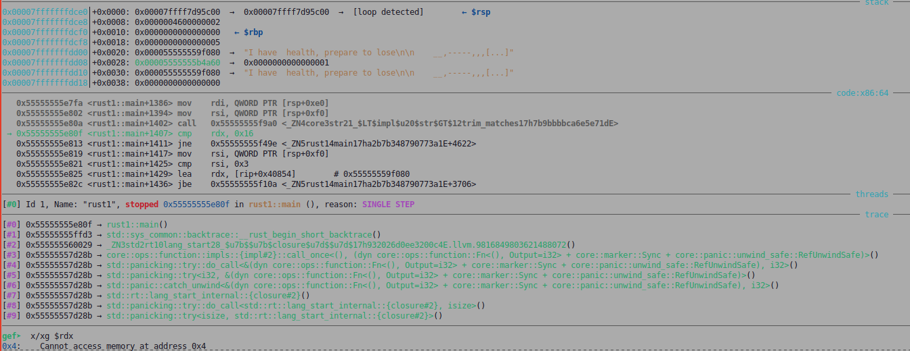

This confirms that when this ```trim_matches``` function is called, our powerup
string length gets stored in rdx.

Our first set of constraints comes next. If you pass the previous check, 
you see that our input is stored at rdi.

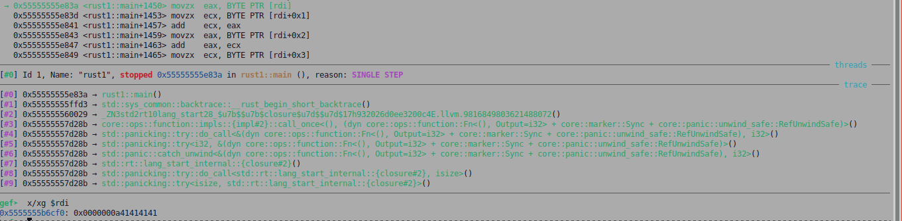

Looks like this takes the hex value of first four characters, 
and this must add up to 0x115
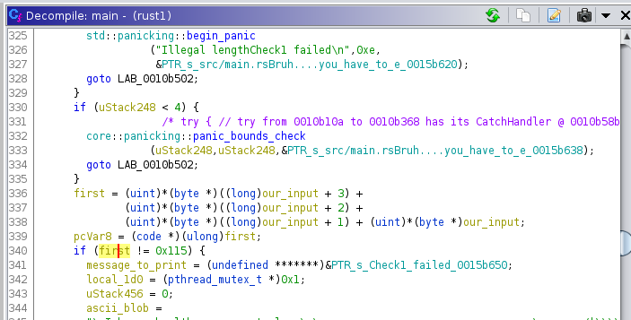

Next, chars 4 to 8 must sum up to 0x1337
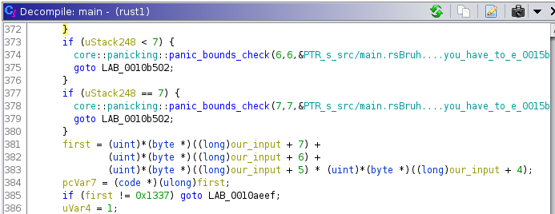

Next, we have a loop that goes over our input and ensures
that our input values are >= 0x21 and < 0x7d
(0x7e - 0x21 == 0x5d, this explains the decompilation at line 391)


A series of checks comes next.....
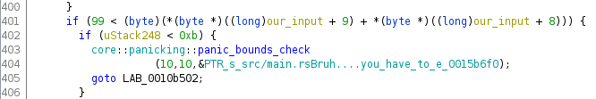
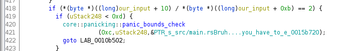
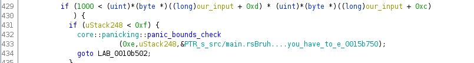

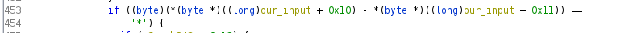


Finally, we see that if the last check succeeds, then we 
set a flag variable to true and this enables the flag to be printed.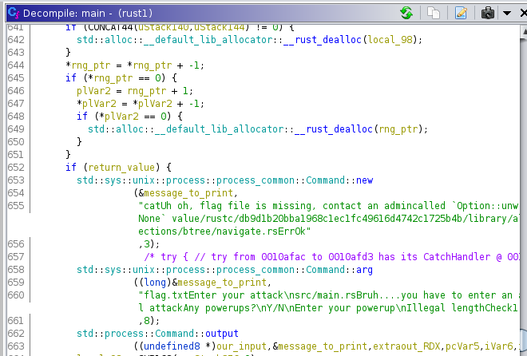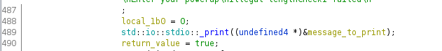

 
### Z3 solution 
There's an easy way to find a string that satisfies these 
conditions, use https://github.com/Z3Prover/z3

Depending your computer specs,
it may take a couple of minutes to get a result.
```
from z3 import *
flag = IntVector("f", 22)
counter = IntVector("f",4)
s = Solver()
for i in range(0, 22):
        s.add(flag[i] >= 0x21)
        s.add(flag[i] <= 0x7e)
s.add(flag[0] + flag[1]+flag[2]+flag[3] == 0x115)
s.add(flag[4] * flag[5] +flag[6] + flag[7] == 0x1337)
s.add(flag[8]  +  flag[9] >= 100)
s.add(flag[10] / flag[11] == 2)
s.add(flag[12] * flag[13] > 1000)
s.add((flag[14] +flag[15])*5 > 200)
s.add(flag[16] - flag[17] == 42)
s.add(flag[18] - flag[19] == 2)
s.add(flag[20] * flag[21] >= 900 )
if(s.check() != unsat):
    mod = s.model()
    for i in range(22):
        x = mod[flag[i]].as_long()
        print (chr(x),end='')
else:
    print("Damn, no sol...")
```


